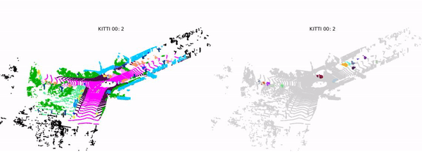

# semantickitti-matlab
Some useful tools written in Matlab for SemanticKITTI

## How to use 
- directory *visualizer*: to show both semantics and instances of data like below. 
    - 
    - a long example is in [the Youtube link](https://youtu.be/gNeEfPEyHuw). 

## Plan
- more to be added... 

## Contact 
- paulgkim@kaist.ac.kr 
